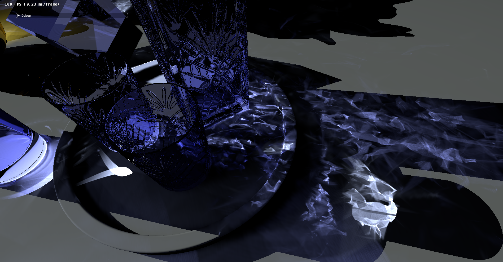

Mesh Caustics Demo
==================

This demo demonstrates an real-time adaptive caustics algorithm.

## Getting Started

To build the demo, one should take the following steps:
1. Download NVIDIA falcor 3.1
2. Make a folder called "Caustics" under \Source\Samples\Raytracing
3. Checkout the repo under the "Caustics" folder
4. Copy content under "Source\Samples\Raytracing\Caustics\Media" folder to "Media" folder under falcor root directory.
5. Add "Caustics.vcxproj" to falcor solution
6. Build falcor with caustics project